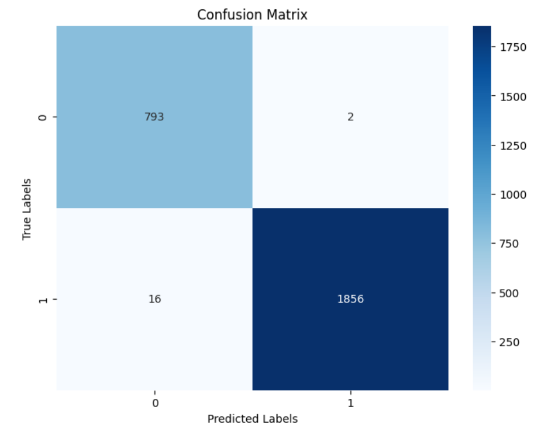

# Fine-Tuning Vision Transformer (ViT) for Image Classification

This repository contains code to fine-tune a Vision Transformer (ViT) model for image classification. The model is trained using the Hugging Face Transformers and Datasets libraries along with PyTorch.

## 🧠 Model

We use the pre-trained `google/vit-base-patch16-224-in21k` Vision Transformer from Hugging Face and fine-tune it on a custom dataset for multi-class image classification.

## 📁 Files

- `code.ipynb` – Jupyter notebook with complete code for:
  - Dataset loading and preprocessing
  - Model loading and customization
  - Training loop with `Trainer`
  - Evaluation and confusion matrix generation
- `confusion_matrix.png` – Visual representation of the model's performance across all classes.

## 📊 Results

A sample confusion matrix is included below to visualize classification accuracy:

